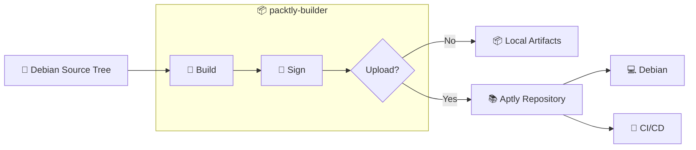

# 1. packtly-builder

**Reproducible Debian package builds with integrated signing and Aptly publishing.**

`packtly-builder` is the build component of the **Packtly** platform. It wraps the Debian packaging toolchain (`debuild`, `dpkg-buildpackage`, `lintian`, GPG) inside rootless Podman containers and drives it with a small Python CLI, so a build behaves the same on a laptop, in CI, and on a release machine.

Pair it with [`packtly-infra`](#related-projects) — which stands up the Aptly repository, HTTP endpoint, and credentials `packtly-builder` publishes to — for a complete, self-hosted APT package pipeline.

## 1.1. Why Packtly Builder?

`debuild` builds a package on whatever host you happen to run it on, with whatever toolchain, GPG keys, and dependencies happen to be installed there. `packtly-builder`:

- Builds inside a pinned, disposable container, so builds are reproducible across machines and CI runners.
- Wraps build → sign → publish as a single command instead of a chain of manual `dpkg-buildpackage`, `debsign`, and `aptly` invocations.
- Understands Aptly: it checks what's already published, skips redundant uploads, and publishes source alongside binaries.
- Needs only Podman, `podman-compose`, and `just` on the host — the packaging toolchain itself never touches the host.

## 1.2. Contents

- [1. packtly-builder](#1-packtly-builder)
  - [1.1. Why Packtly Builder?](#11-why-packtly-builder)
  - [1.2. Contents](#12-contents)
  - [1.3. Features](#13-features)
  - [1.4. Architecture](#14-architecture)
    - [1.4.1. Package Build Workflow](#141-package-build-workflow)
    - [1.4.2. What Gets Built?](#142-what-gets-built)
  - [1.5. Getting Started](#15-getting-started)
    - [1.5.1. Using the Runtime Container](#151-using-the-runtime-container)
    - [1.5.2. Multi-Architecture Builds](#152-multi-architecture-builds)
  - [1.6. CLI Reference](#16-cli-reference)
    - [1.6.1. Usage](#161-usage)
    - [1.6.2. Command-line Options](#162-command-line-options)
    - [1.6.3. Build Modes](#163-build-modes)
    - [1.6.4. Publishing](#164-publishing)
  - [1.7. Signing \& Credentials](#17-signing--credentials)
  - [1.8. Development](#18-development)
    - [1.8.1. Quick Start](#181-quick-start)
    - [1.8.2. Container Images](#182-container-images)
    - [1.8.3. Project Structure](#183-project-structure)
    - [1.8.4. just Targets](#184-just-targets)
    - [1.8.5. Dev Container](#185-dev-container)
    - [1.8.6. Local Development](#186-local-development)
  - [1.9. Versioning](#19-versioning)
  - [1.10. Related Projects](#110-related-projects)

## 1.3. Features

- Container-native Debian package builds
- Reproducible build environments
- Binary and source package generation
- Multi-architecture support (amd64, arm64, armhf)
- Automatic GPG package signing
- Automatic Aptly publishing
- Debian source package publishing
- VS Code Dev Container

## 1.4. Architecture

### 1.4.1. Package Build Workflow



The build pipeline creates reproducible Debian packages inside isolated containers, signs the resulting artifacts with GPG, and optionally publishes them to an Aptly repository for immediate consumption by Debian systems, CI/CD pipelines, and embedded Linux build systems.

### 1.4.2. What Gets Built?

A build produces one or more of the following artifacts in different architectures (amd64, arm64, armhf):

- Debian binary packages (`.deb`)
- Debian source packages (`.dsc`)
- Original source archives (`.orig.tar.*`)
- Debian packaging archives (`.debian.tar.*`)
- Build metadata (`.changes`, `.buildinfo`)
- GPG-signed release artifacts
- Multi-architecture package builds

## 1.5. Getting Started

### 1.5.1. Using the Runtime Container

The `packtly-builder` runtime image includes `packtly_builder_tooling` as its ENTRYPOINT, so starting the container is equivalent to invoking the CLI directly.
A typical build is performed with a single `podman run` command that mounts the Debian source tree, GPG signing keys, Aptly credentials, and a log directory into the container:

```bash
podman run --rm \
  --platform "linux/amd64" \
  -v "$PWD":/workspace:Z \
  -v "$KEYS_DIR/public/repo_signing.key":/opt/keys/gpg/repo_signing.key:Z,ro \
  -v "$KEYS_DIR/private/repo_signing_private.key":/opt/keys/gpg/repo_signing_private.key:Z,ro \
  -v "$KEYS_DIR/private/repo_signing_private_pass":/opt/keys/gpg/repo_signing_private_pass:Z,ro \
  -v "$APTLY_CREDENTIALS_FILE":/run/secrets/aptly-credentials:Z,ro \
  -v "$PWD/logs":/logs:Z \
  -e APTLYHOST=http://localhost:8080 \
  --network=host \
  ghcr.io/packtly/packtly-builder:latest \
  /workspace/debhello-quilt \
  --log-file /logs/build.log \
  --dist trixie-apollo \
  --component main \
  --credentials-file /run/secrets/aptly-credentials
```

| Mount / flag                                      | Purpose                                                                                |
| ------------------------------------------------- | -------------------------------------------------------------------------------------- |
| `-v <source>:/workspace`                          | Mounts the Debian source tree. This path is passed to the CLI as the builddir argument |
| `-v .../repo_signing*.key:/opt/keys/gpg/...`      | Mounts the GPG signing key material read-only.                                         |
| `-v <credentials>:/run/secrets/aptly-credentials` | Mounts the Aptly REST API credentials read-only.                                       |
| `-v <logs>:/logs`                                 | Stores build logs generated by --log-file on the host.                                 |
| `-e APTLYHOST=...`                                | Specifies the Aptly API endpoint.                                                      |
| `--network=host`                                  | Allows the container to communicate directly with a locally running Aptly instance.    |

For a complete example, see [`test/fixtures/build-quilt.sh`](test/fixtures/build-quilt.sh) The script wraps the container invocation into convenient
into convenient `build`, `upload`, `force-upload`, and all actions. The --no-build --upload combination reuses the same runtime image to sign and publish previously built artifacts without rebuilding the package.

### 1.5.2. Multi-Architecture Builds

packtly-builder is published as a multi-architecture container image. The target architecture is selected entirely through Podman's --platform option—there is no separate --arch flag in the CLI.

| Platform   | Target architecture |
| ---------- | ------------------- |
| --platform | linux/amd64         | amd64 |
| --platform | linux/arm64         | arm64 |
| --platform | linux/arm/v7        | armhf |

Internally, `packtly_builder_tooling` detects the architecture it is running under (via `platform.machine()`) and configures the build accordingly, including selecting the appropriate Aptly repository endpoints.


The container itself is built per architecture (see [Container Images](#182-container-images)); which architecture a given `podman run` builds *for* is controlled entirely by Podman's `--platform` flag — the CLI has no separate `--arch` option. It simply detects the architecture it is actually running under (`platform.machine()`) and acts accordingly (e.g. when checking/uploading to the matching Aptly endpoint).

For example, to build for arm64:
```bash
podman run \
  --platform linux/arm64 \
  ... \
  ghcr.io/packtly/packtly-builder:latest \
  /workspace/debhello-quilt
```
On an amd64 host, running linux/arm64 or linux/arm/v7 containers requires QEMU user-mode emulation via binfmt_misc (typically provided by the qemu-user-static and binfmt-support packages), allowing foreign-architecture binaries to execute transparently inside the container.

The reference script [`test/fixtures/build-quilt.sh`](test/fixtures/build-quilt.sh)

exposes the target architecture as its second argument (default: amd64):

```bash
./build-quilt.sh build arm64
```
The script performs a full source package build only for `amd64`, as the architecture-independent source package needs to be created only once. Subsequent architecture builds reuse the same source package and produce only the architecture-specific binary packages.

In CI, this approach scales naturally to a build matrix with one job per target architecture. Native runners are used where available, while QEMU emulation is only required for `armhf`. The resulting architecture-specific images are finally assembled into a single multi-architecture OCI manifest, allowing `ghcr.io/packtly/packtly-builder:latest` to automatically resolve to the correct image for the host platform.

## 1.6. CLI Reference

### 1.6.1. Usage

The runtime image provides the `packtly_builder_tooling` command.

```text
packtly_builder_tooling <builddir> [options]
```

### 1.6.2. Command-line Options

| Option                              | Description                                                              |
| ----------------------------------- | ------------------------------------------------------------------------ |
| `builddir`                          | Path to the Debian build directory (positional, required)                |
| `--build-mode {binary,source,full}` | What to build: `binary` (default), `source`, or `full` (source + binary) |
| `--no-build`                        | Skip the build step (sign/upload existing artifacts)                     |
| `--aptlyhost URL`                   | Aptly REST API base URL (falls back to the `APTLYHOST` env var)          |
| `--dist NAME`                       | Aptly publish distribution (e.g. `trixie-apollo`)                        |
| `--component NAME`                  | Aptly component (e.g. `main`)                                            |
| `--credentials-file PATH`           | Aptly credentials file (default: `/run/secrets/aptly-credentials`)       |
| `--upload`                          | Upload the built package to Aptly after signing                          |
| `--force-upload`                    | Upload even if the package already exists upstream                       |
| `--log-file PATH`                   | Also write log output to this file                                       |
| `--verbose`, `-v`                   | Enable debug logging                                                     |

### 1.6.3. Build Modes

| Mode     | Description                      |
| -------- | -------------------------------- |
| `binary` | Build binary packages only       |
| `source` | Build Debian source package      |
| `full`   | Build source and binary packages |

### 1.6.4. Publishing

The CLI can optionally:

- sign packages with GPG
- upload artifacts to an Aptly repository
- skip packages already published
- force uploads when required

---

## 1.7. Signing & Credentials

Repository signing keys are mounted into the container at:

```text
/opt/keys/gpg/
```

The builder automatically imports the configured signing key and uses it for:

- Debian package signing
- Source package signing
- Repository uploads

Aptly API credentials are read from:

```text
/run/secrets/aptly-credentials
```

making the builder suitable for local development and CI/CD environments.

---

## 1.8. Development

`packtly-builder` consists of three major components:

| Component                   | Description                                                                           |
| --------------------------- | ------------------------------------------------------------------------------------- |
| **Container Images**        | Layered Podman images containing the complete Debian packaging toolchain.             |
| **packtly_builder_tooling** | Python CLI for building, signing, and publishing Debian packages.                     |
| **CI/CD Pipeline**          | Automated image builds, testing, multi-architecture releases, and package publishing. |

### 1.8.1. Quick Start

Build the complete runtime image:

```bash
git clone https://github.com/packtly/packtly-builder.git
cd packtly-builder

just all
```

Or execute each stage individually:

```bash
just build-builder
just test-tooling
just build-tooling
just build-runtime
```

List all available tasks:

```bash
just
```

### 1.8.2. Container Images

| Image                          | Purpose                          |
| ------------------------------ | -------------------------------- |
| `packtly-builder-base`         | Debian packaging toolchain       |
| `packtly-builder-builder`      | Build and test environment       |
| `packtly-builder`              | Runtime image for package builds |
| `packtly-builder-devcontainer` | VS Code Dev Container            |

All images support **amd64** and **arm64**.

### 1.8.3. Project Structure

```text
packtly-builder/
├── tooling/                 # Python CLI
├── tests/                   # Unit and integration tests
├── container/               # Container definitions
├── Keys/                    # Development signing keys
├── scripts/                 # Helper scripts
├── justfile                 # Development workflow
├── Containerfile            # Runtime image
└── .github/workflows/       # GitHub Actions
```

### 1.8.4. just Targets

| Target                                                          | Description                                                                                   |
| --------------------------------------------------------------- | --------------------------------------------------------------------------------------------- |
| `just` / `just list`                                            | List all available recipes                                                                    |
| `just build-base [arch]`                                        | Build the base toolchain image                                                                |
| `just build-builder [arch]`                                     | Build the build/test environment image                                                        |
| `just build-runtime [arch]`                                     | Build the runtime image                                                                       |
| `just build-devcontainer [arch]`                                | Build the VS Code Dev Container image                                                         |
| `just build-builder-multiarch` / `just build-runtime-multiarch` | Build and assemble multi-arch manifests (amd64 + arm64)                                       |
| `just build-tooling`                                            | Build the `packtly_builder_tooling` Python wheel inside the builder container                 |
| `just test-tooling [arch]`                                      | Run the tooling test suite inside the builder container                                       |
| `just shell`                                                    | Drop into an interactive shell in the builder container                                       |
| `just clean-containers` / `just clean`                          | Remove built images / build artifacts                                                         |
| `just lint-robot`                                               | Lint Robot Framework test suites with `robocop`                                               |
| `just all`                                                      | Full pipeline: `build-builder` → `test-tooling` → `build-tooling` → `build-runtime-multiarch` |

### 1.8.5. Dev Container

The project ships with a complete VS Code Dev Container (`packtly-builder-devcontainer`), pre-configured with Poetry, the Debian packaging toolchain, and the linting/test tools used by CI. Open the repository in VS Code and select **Reopen in Container** to get a ready-to-use development environment without installing anything on the host beyond Podman.

### 1.8.6. Local Development

For local development of the `packtly_builder_tooling` CLI:

```bash
cd tooling

just prepare
just test
just pytest
just mypy
just flake8
```

---

## 1.9. Versioning

Release versions are derived from `CHANGELOG.md` using semantic versioning.

CI automatically:

- builds multi-architecture images
- executes the test suite
- publishes container images
- creates GitHub releases

---

## 1.10. Related Projects

| Project             | Description                                               |
| ------------------- | --------------------------------------------------------- |
| **Packtly**         | Platform overview                                         |
| **packtly-builder** | Container-native Debian package builder (this repository) |
| **packtly-infra**   | Deploy and operate an Aptly repository platform           |
