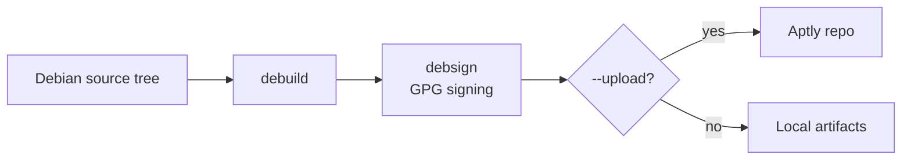

# packtly-builder

A containerized build system for **building, signing, and publishing Debian packages** to an [Aptly](https://www.aptly.info/) repository — reproducibly inside Podman containers, with no build tooling required on the host.

---

## Table of contents

- [Overview](#overview)
- [How it works](#how-it-works)
- [Prerequisites](#prerequisites)
- [Quick start](#quick-start)
- [Container images](#container-images)
- [`just` targets](#just-targets)
- [The `packtly_builder_tooling` CLI](#the-packtly_builder_tooling-cli)
- [Signing keys & credentials](#signing-keys--credentials)
- [Development](#development)
- [Versioning & releases](#versioning--releases)
- [Related projects](#related-projects)

---

## Overview

packtly-builder bundles three things:

- **Container images** — a layered set of Podman images based on Debian Trixie that carry the full Debian packaging toolchain (`debhelper`, `devscripts`, `gnupg2`, `git-buildpackage`, …).
- **`packtly_builder_tooling`** — a Python CLI that orchestrates the build → sign → publish pipeline for a single source tree.
- **CI/CD** — a GitLab CI pipeline that builds the images, runs the tooling test suite, and cuts versioned, multi-arch releases.

## How it works



The CLI builds the package with `debuild`, signs the resulting `.changes`/`.dsc` with a configured GPG key, and — when `--upload` is given and an Aptly host is reachable — publishes the artifacts, skipping anything already deployed upstream.

## Prerequisites

On the **host** you only need a container runtime and a task runner:

- [Podman](https://podman.io/) and [podman-compose](https://github.com/containers/podman-compose)
- [just](https://github.com/casey/just)
- [yq](https://github.com/mikefarah/yq) (used by some `just` targets)

Everything else (the Debian toolchain, Python, Poetry) lives inside the images.

## Quick start

```bash
# Build the builder image, run tests, build the wheel, build the runtime image
just all

# …or step by step:
just build-builder        # Build the builder image
just test-tooling-keys    # Verify the GPG key setup
just test-tooling         # Run the Python test suite
just build-tooling        # Build the packtly_builder_tooling wheel
just build-runtime        # Build the final runtime image
```

List every available target at any time:

```bash
just            # equivalent to `just --list`
```

## Container images

| Image | Built from | Purpose |
|---|---|---|
| `packtly-builder-base` | Debian Trixie | Debian packaging toolchain (`debhelper`, `devscripts`, `gnupg2`, …) |
| `packtly-builder-builder` | base | + Poetry, `just`, Node, and the tooling venv — used for CI builds & tests |
| `packtly-builder` (runtime) | base | + the installed `packtly_builder_tooling` wheel; entrypoint for real builds |
| `packtly-builder-devcontainer` | builder | Builder image wired up for VS Code Dev Containers |

Container build targets accept an optional **architecture** argument (`amd64` by default, `arm64` also supported), e.g. `just build-builder arm64`.

## `just` targets

### Build

| Target | Description |
|---|---|
| `build-base [arch]` | Build the base image |
| `build-builder [arch]` | Build the builder image |
| `build-runtime [arch]` | Build the runtime image |
| `build-devcontainer [arch]` | Build the devcontainer image |
| `build-builder-multiarch` | Build the builder image for amd64 + arm64 and assemble a manifest |
| `build-runtime-multiarch` | Build the runtime image for amd64 + arm64 and assemble a manifest |
| `build-tooling` | Build the `packtly_builder_tooling` Python wheel |

### Test

| Target | Description |
|---|---|
| `test-tooling [arch]` | Run the full pytest suite inside the builder container |
| `test-tooling-keys [arch]` | Verify GPG key availability before tests |

### Clean

| Target | Description |
|---|---|
| `clean-base` | Remove the base image |
| `clean-builder` | Remove the builder image |
| `clean-runtime` | Remove the runtime image |
| `clean-devcontainer` | Remove the devcontainer image |
| `clean-containers` | Remove all container images |
| `clean` | Remove all images **and** built wheel artifacts |

### Utilities & pipeline

| Target | Description |
|---|---|
| `shell` | Open an interactive bash shell in the builder container |
| `all` | Full pipeline: `build-builder` → `test-tooling` → `build-tooling` → `build-runtime-multiarch` |

## The `packtly_builder_tooling` CLI

The CLI is the entrypoint of the runtime image. It builds, signs, and optionally uploads a single Debian package.

```
packtly_builder_tooling <builddir> [options]
```

| Option | Description |
|---|---|
| `builddir` | Path to the Debian build directory (positional, required) |
| `--build-mode {binary,source,full}` | What to build: `binary` (default), `source`, or `full` (source + binary) |
| `--no-build` | Skip the build step (sign/upload existing artifacts) |
| `--aptlyhost URL` | Aptly REST API base URL (falls back to the `APTLYHOST` env var) |
| `--dist NAME` | Aptly publish distribution (e.g. `trixie-apollo`) |
| `--component NAME` | Aptly component (e.g. `main`) |
| `--credentials-file PATH` | Aptly credentials file (default: `/run/secrets/aptly-credentials`) |
| `--upload` | Upload the built package to Aptly after signing |
| `--force-upload` | Upload even if the package already exists upstream |
| `--log-file PATH` | Also write log output to this file |
| `--verbose`, `-v` | Enable debug logging |

### Build modes

| Mode | `debuild` flag | Produces |
|---|---|---|
| `binary` | `-b` | Binary packages only (no `.orig` tarball required) |
| `source` | `-S` | Source package only |
| `full` | `-F` | Source **and** binary packages |

## Signing keys & credentials

GPG signing keys are read from these fixed paths inside the container:

```
/opt/keys/gpg/repo_signing.key            # public key
/opt/keys/gpg/repo_signing_private.key    # private key
/opt/keys/gpg/repo_signing_private_pass   # passphrase
```

Locally, the `just` targets mount `Keys/gpg/` into `/opt/keys/gpg`, so place your keys there before running builds. Aptly credentials are read from a simple `key = value` file (default `/run/secrets/aptly-credentials`) containing `username` and `password`.

## Development

The repository ships a VS Code Dev Container configuration. Open the project in VS Code and choose **Reopen in Container** for a fully configured Debian build environment.

For local development on the tooling without a devcontainer:

```bash
cd packtly-builder/tooling
just prepare   # Install Poetry dependencies (incl. dev tools)
just test      # flake8 + mypy + pytest
just pytest    # Run tests only
just mypy      # Type-check
just flake8    # Lint
```

## Versioning & releases

The release version is driven by `CHANGELOG.md` (Keep a Changelog format). At release time, CI reads the latest `## [x.y.z]` entry and applies it as the container image label and Git tag.

## Related projects

- **[packtly-infra](https://github.com/packtly/packtly-infra)** — Infrastructure automation for deploying packtly: a self-hosted Debian package repository based on [Aptly](https://www.aptly.info/) and [nginx](https://nginx.org/), running as a rootless Podman container managed by systemd Quadlets.
